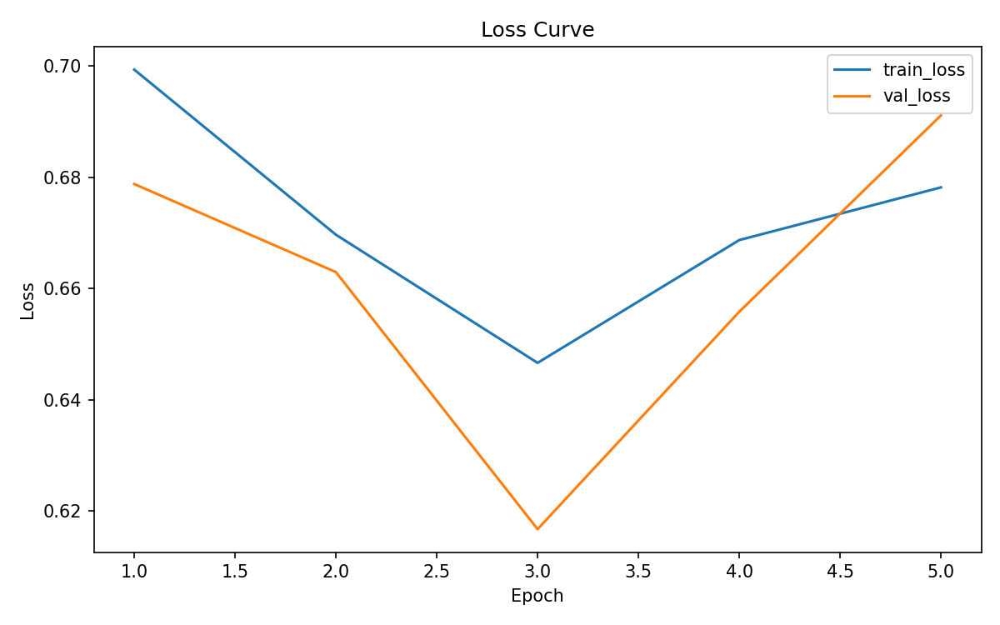
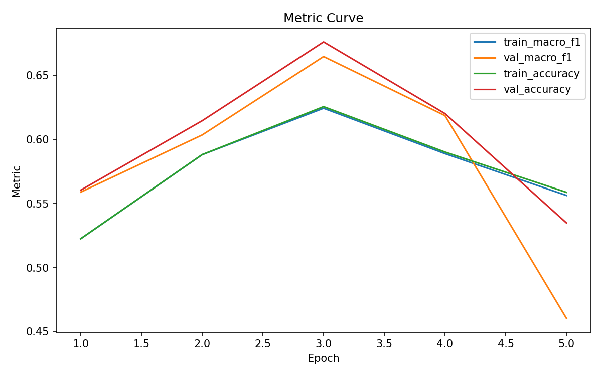

# CSC4007 — Lab 3 Analysis Report (RNN + W&B)

## 1. Thông tin 
- W&B project: https://wandb.ai/mmmi/csc4007-lab3-rnn?nw=nwusermmii

## 2. Mục tiêu thí nghiệm
- Xây dựng cấu trúc dữ liệu dạng chuỗi: Chuyển đổi từ biểu diễn đặc trưng rời rạc (BoW/TF-IDF) sang dạng chuỗi chỉ số (Token Sequence) kết hợp kỹ thuật Padding để xử lý dữ liệu đầu vào có độ dài biến thiên.

- Áp dụng kiến trúc Recurrent Neural Network (RNN): Thực thi mô hình Embedding kết hợp RNN để khai thác thông tin ngữ cảnh và mối tương quan thứ tự giữa các từ trong bài toán phân loại cảm xúc.

- Tối ưu hóa và quản lý thí nghiệm: Sử dụng Weights & Biases (W&B) để theo dõi biến thiên hàm mất mát (loss), độ chính xác (accuracy) và kiểm soát hiện tượng Overfitting qua các siêu tham số (hyperparameters).

- Lab 3 khác Lab 2 ở điểm nào?
Khác biệt cốt lõi nằm ở phương pháp biểu diễn và mô hình hóa. Lab 2 sử dụng các thuật toán học máy truyền thống trên không gian đặc trưng tĩnh (static features), trong khi Lab 3 áp dụng mạng thần kinh nhân tạo trên không gian vector động (Embedding) và kiến trúc đệ quy (RNN) để xử lý dữ liệu động theo bước thời gian.
- Vì sao cần chuyển từ BoW/TF-IDF sang mô hình chuỗi?
Để khắc phục sự mất mát thông tin cấu trúc. BoW/TF-IDF giả định các từ độc lập, làm mất đi ngữ nghĩa của các cụm từ (ví dụ: "not bad"). Mô hình chuỗi cho phép mô hình tích lũy trạng thái ẩn (hidden state) qua từng token, từ đó bảo toàn được logic cú pháp và sắc thái biểu đạt phụ thuộc vào thứ tự từ.
- Bạn kỳ vọng RNN cải thiện điều gì trên IMDB?
RNN được kỳ vọng nâng cao khả năng phân loại các đánh giá có tính ngữ cảnh cao. Cụ thể là xử lý tốt các hiện tượng phủ định, đảo ngữ, hoặc các bài đánh giá dài có sự chuyển biến cảm xúc phức tạp mà các mô hình Baseline thường nhầm lẫn do chỉ dựa vào tần suất xuất hiện của từ khóa đơn lẻ.
## 3. Sequence audit
Dựa trên `outputs/logs/sequence_audit.md`, nêu ít nhất 3 nhận xét có số liệu hoặc bằng chứng cụ thể.

1. Phân bố độ dài review và hiện tượng cắt cụt dữ liệu (Truncation)

Độ dài trung vị của các bài review là 196.00 tokens, nhưng giá trị P95 (95% dữ liệu) lên tới 665.00 tokens. Trong khi đó, max_len được thiết lập là 256, dẫn đến tỷ lệ dữ liệu bị cắt cụt (truncation_rate) là 34.75%. Điều này cho thấy hơn 1/3 số lượng review trong tập huấn luyện không được giữ lại toàn bộ nội dung mà bị mất đi phần đuôi.

2. Sự hợp lý của tham số max_len và tỷ lệ đệm (Padding)

Mặc dù có tỷ lệ cắt cụt cao, nhưng tỷ lệ lấp đầy trung bình (avg_pad_ratio) vẫn ở mức 25.37%. Điều này chứng tỏ tập dữ liệu có sự phân hóa độ dài rất lớn: một nhóm đáng kể các bài review rất ngắn (dưới 256 tokens) cần phải chèn thêm các ký tự trống (padding), trong khi một nhóm khác lại quá dài và bị cắt bỏ. Thiết lập max_len = 256 hiện tại là một sự đánh đổi để tiết kiệm tài nguyên tính toán, nhưng chưa thực sự tối ưu để bao quát toàn bộ thông tin của tập dữ liệu.

3. Ảnh hưởng đến bài toán Sentiment Classification

Việc có tới 34.75% bài review bị cắt ngắn có thể gây tác động tiêu cực đến độ chính xác của mô hình RNN. Trong phân loại cảm xúc, người dùng thường đưa ra kết luận hoặc tóm tắt thái độ ở cuối bài viết. Khi bị cắt mất phần này, mô hình chỉ tiếp nhận được phần mô tả dẫn nhập, dẫn đến việc mất đi các từ khóa quyết định (sentiment signals) ở đoạn cuối, từ đó làm giảm khả năng phân loại đúng các bài review dài và phức tạp.

## 4. Thiết lập mô hình và huấn luyện
Ghi lại cấu hình tốt nhất của bạn:

- vocab_size: 20000
- max_len: 256
- embed_dim: 128
- hidden_dim: 64
- batch_size: 64
- epochs: 30
- learning rate: 0.001
- dropout: 0.3
- seed: 42
- early stopping patience: 2
- wandb_mode: on

Giải thích ngắn gọn vì sao bạn chọn cấu hình này.

Các giá trị marco-f1, accuracy và loss cả train và validation ở run 3 đều đạt kết quả tốt nhất.
## 5. Baseline ML vs RNN
Điền bảng dựa trên `outputs/metrics/baseline_vs_rnn.csv`.

| Mô hình | Accuracy | Macro-F1 | Ghi chú |
|---|---:|---:|---|
| Baseline ML (Lab 2) | 0.9064 | 0.9064 | Kết quả tốt |
| RNN (Lab 3) | 0.66884 | 0.6581395327211472 | Kết quả khá kém |

### Nhận xét (5–7 dòng)

Kết quả thực nghiệm cho thấy mô hình RNN hiện tại hoạt động kém hơn đáng kể so với Baseline ML (Logistic Regression/SVM) từ Lab 2, với độ chênh lệch Accuracy lên tới gần 24%. Nguyên nhân chính dẫn đến sự sụt giảm này là do Baseline ML sử dụng TF-IDF với toàn bộ từ vựng, trong khi RNN đang bị hạn chế bởi lớp Embedding chưa được tiền huấn luyện và kiến trúc mạng đơn giản dễ gặp hiện tượng triệt tiêu gradient (vanishing gradient). Ngoài ra, tỉ lệ cắt cụt dữ liệu (truncation_rate) lên tới 34.75% ở Lab 3 đã làm mất đi nhiều từ khóa mang tính quyết định ở cuối các bài đánh giá dài, điều mà BoW/TF-IDF ở Lab 2 vẫn giữ lại được thông qua tần suất từ. Mặc dù về lý thuyết RNN có khả năng xử lý thứ tự từ và ngữ cảnh, nhưng với cấu hình hiện tại, mô hình chưa đủ độ sâu và dữ liệu chưa đủ sạch để vượt qua khả năng phân loại mạnh mẽ của các phương pháp thống kê cổ điển trên tập dữ liệu IMDB.

Trả lời:
- RNN có tốt hơn baseline hay không?

Hiện tại là không, kết quả RNN (0.668) thấp hơn nhiều so với Baseline (0.906). Ngoài ra mô hình RNN chưa phân biệt tốt nhãn negative, còn bị lẫn thành positive nhiều.

- Nếu chưa tốt hơn, nguyên nhân hợp lý là gì?

Do thiết lập max_len còn ngắn gây mất thông tin, mô hình RNN cơ bản khó học các phụ thuộc xa (long-term dependencies), và có thể do thiếu các kỹ thuật điều chỉnh như Dropout hoặc Learning Rate Scheduler phù hợp.

- Vai trò của thứ tự từ trong bài toán IMDB thể hiện ra sao?

Trong bài toán IMDB, thứ tự từ rất quan trọng để hiểu các cấu trúc phủ định ("not good") hoặc mỉa mai. Tuy nhiên, nếu mô hình chưa hội tụ hoặc bị mất thông tin do cắt ngắn chuỗi, ưu thế về thứ tự từ của RNN sẽ bị triệt tiêu bởi sự thiếu hụt thông tin đầu vào so với cách tiếp cận toàn diện của Baseline ML.

## 6. Learning curves và W&B
Đính kèm hoặc chèn:
- `outputs/figures/loss_curve.png`

- `outputs/figures/metric_curve.png`

Trả lời ngắn các câu hỏi sau:
- Epoch tốt nhất là epoch nào? 

Epoch 3

- Có dấu hiệu overfitting không?

Dấu hiệu overfitting epoch 4, 5

- W&B giúp bạn quan sát điều gì rõ hơn so với chỉ đọc terminal log?

W&B vẽ biểu đồ Macro-F1, Loss và Accuracy theo thời gian thực.

Dễ dàng nhận biết: có thể thấy rõ ràng hơn sự thay đổi của các chỉ số đánh giá qua từng epoch.

So sánh đa nhiệm: có thể chồng các biểu đồ của nhiều lần chạy (runs) khác nhau lên nhau để xem thử nghiệm nào hiệu quả hơn.

- Bạn có so sánh ít nhất 2 run không? Nếu có, run nào tốt hơn và vì sao?

Run 3 là tốt nhất. Lí do run 3 tốt hơn run 1 là vì run 1 có nhiều lớp ẩn hơn (128, trong khi run 3 là 64), khi số lượng tham số quá lớn mà không có đủ dữ liệu hoặc kỹ thuật điều chỉnh (regularization) mạnh, mô hình sẽ dễ dàng "học vẹt" (memorize) các mẫu nhiễu thay vì học ý nghĩa thực sự, dẫn đến underfitting do mô hình phức tạp hơn cần thiết.

## 7. Error analysis (ít nhất 10 mẫu sai)
Dựa trên `outputs/error_analysis/error_analysis.csv`, chọn và phân tích ít nhất 10 mẫu dự đoán sai.

### Gợi ý nhóm lỗi
- phủ định;
- mixed sentiment;
- review dài;
- sarcasm/irony;
- mô hình rất tự tin nhưng vẫn sai;
- câu có nhiều chuyển ý hoặc phụ thuộc ngữ cảnh xa.

### Tổng hợp lỗi
1. Nhóm lỗi Negation (Phủ định): 

Chiếm đa số mẫu sai. Mô hình RNN bị đánh lừa bởi sự xuất hiện của các từ phủ định hoặc tính từ tiêu cực ("bad", "evil", "not") mặc dù chúng được dùng để khen ngợi hoặc mô tả nội dung phim (ví dụ: "chơi vai ác rất tốt").

2. Nhóm lỗi Mixed Sentiment (Cảm xúc hỗn hợp): 

Các review có sự so sánh giữa phim này và phim khác (ví dụ: "phim này không hay bằng Better Off Dead nhưng vẫn vui"). Mô hình không phân biệt được đâu là đối tượng chính được khen.

3. Nhóm lỗi Long Review & Context (Ngữ cảnh xa): 

Trong các bài đánh giá dài, các từ mang sắc thái tích cực nằm rải rác hoặc xuất hiện ở tận cuối bài. RNN cơ bản thường bị mất thông tin đầu chuỗi hoặc không kết nối được các tín hiệu tích cực khi có quá nhiều tình tiết mô tả ở giữa.

### Ví dụ bảng ghi nhận lỗi
| ID | True label | Pred label | Vì sao sai? | Hướng cải thiện |
|---|---|---|---|---|
| 1 | Pos | Neg | Negation & Context: Chứa các cụm "slaving away", "tired and weary". Mô hình tập trung vào các từ tiêu cực này thay vì hiểu rằng bộ phim là giải pháp để "feel better". | Tăng cường dữ liệu có cấu trúc "A làm giảm B". |
| 2 | Pos | Neg | Comparative Sentiment: Review so sánh nhiều với phim "Better Off Dead" (được khen nhiều hơn). Mô hình bị nhiễu bởi các câu so sánh tiêu cực cho phim hiện tại. | Sử dụng Attention để tập trung vào đối tượng chính của câu. |
| 3 | Pos | Neg | Semantic Ambiguity: "Did her evil part very well". Từ "evil" và "weak script" mang trọng số tiêu cực quá lớn khiến RNN bỏ qua từ "recommend". | Sử dụng Pre-trained Embedding (Word2Vec/FastText) để hiểu ngữ nghĩa tốt hơn. |
| 4 | Pos | Neg | Specific Negation: "Skip over some important details", "fraud", "too bad". Các từ này mô tả tình tiết lịch sử nhưng mô hình hiểu lầm là đánh giá tiêu cực về chất lượng phim. | Huấn luyện với số epoch nhiều hơn hoặc thêm Dropout để tránh học vẹt từ khóa. |
| 5 | Pos | Neg | Contextual Polarity: Mô tả nhân vật là "bad guy", "nasty", "never-reformed". Đây là lời khen về diễn xuất nhưng mô hình hiểu là cảm xúc tiêu cực.  | Sử dụng mô hình hai chiều (Bi-RNN) để nắm bắt ngữ cảnh từ cả hai phía. |
| 6 | Pos | Neg | Long Review (Vanishing Gradient): Review quá dài, mô tả về nghiện ngập ("heroin", "addiction", "murder"). RNN cơ bản không giữ được tín hiệu tích cực ở cuối bài. | Thay thế RNN bằng LSTM hoặc GRU để nhớ thông tin dài hơn. |
| 7 | Pos | Neg | Slang & Cultural Context: "merely says 'Sh-te'", "drunk manager". Những từ lóng này mang sắc thái hài hước nhưng mô hình phân loại chúng vào nhóm tiêu cực. | Mở rộng Vocab và sử dụng dữ liệu augment (tăng cường) chứa từ lóng. |
| 8 | Pos | Neg | Subtle Sentiment: "suffering", "not yet truly free", "short". Phim về đề tài xã hội nặng nề nên dùng nhiều từ tiêu cực dù người xem đánh giá cao (Worth a look). | Sử dụng Sentiment Lexicon để hỗ trợ mô hình nhận diện các từ chốt. |
| 9 | Pos | Neg | Confident Failure: Mô hình rất tự tin (Prob Neg: 0.83). Có thể do từ "gritty", "sexy", "bizarre" trong tập train thường đi với nhãn Negative. | Kiểm tra lại độ cân bằng của tập dữ liệu và gán nhãn lại nếu cần. |
| 10 | Pos | Neg | Mixed Opinions: "Don't like him much", "unnecessary". Người viết chê diễn viên nhưng khen bộ phim tổng thể ("enjoyed Haggard"). RNN bị kẹt ở các câu chê đầu bài. | Tăng max_len và tập trung vào các câu tổng kết cuối bài review. |

## 8. Bài học rút ra

- Ưu điểm và hạn chế của RNN: nhận thấy RNN có khả năng biểu diễn ngữ cảnh nhờ cơ chế tích lũy trạng thái ẩn qua thời gian, giúp nắm bắt được thứ tự từ mà BoW bỏ sót. Tuy nhiên, RNN đơn giản lại rất nhạy cảm với nhiễu và dễ gặp hiện tượng triệt tiêu gradient, khiến nó khó học được các phụ thuộc xa trong các bài đánh giá dài.

- Vai trò của Sequence Length: Thông số max_len đóng vai trò then chốt trong việc cân bằng giữa hiệu năng và tài nguyên. Tỷ lệ truncation cao (34.75%) chính là minh chứng cho việc mất mát thông tin quan trọng ở cuối câu, trực tiếp làm giảm độ chính xác của mô hình chuỗi.

- Tầm quan trọng của Validation Set và Learning Curves: Việc quan sát đồ thị hàm mất mát và độ chính xác qua từng epoch giúp nhận diện sớm hiện tượng Overfitting (như tại Epoch 5 của thí nghiệm 1). Nếu không có tập validation, chúng ta sẽ lầm tưởng mô hình đang học tốt trong khi thực tế nó chỉ đang học vẹt dữ liệu huấn luyện.

- Lợi ích của W&B: Công cụ này giúp hệ thống hóa toàn bộ quá trình thử nghiệm. Việc log lại siêu tham số và biểu đồ giúp người dùng so sánh trực quan giữa các lần chạy (như khi thay đổi hidden_dim), từ đó đưa ra quyết định điều chỉnh dựa trên số liệu thực thay vì phỏng đoán.

## 9. Tự đánh giá theo rubric
Sinh viên tự chấm sơ bộ theo `reports/rubric.md` trước khi nộp bài.

Tổng điểm: **8.5 điểm**

### 1. Repo chạy được và artefact đầy đủ (2.0 điểm)

### 2. Mô hình RNN và quy trình huấn luyện đúng (2.0 điểm)

### 3. Sử dụng W&B hợp lý (1.5 điểm)

### 4. So sánh baseline ML vs RNN (0.75/1.5 điểm)

### 5. Learning curves và diễn giải kết quả (0.75/1.5 điểm)

### 6. Error analysis (1.5 điểm)

